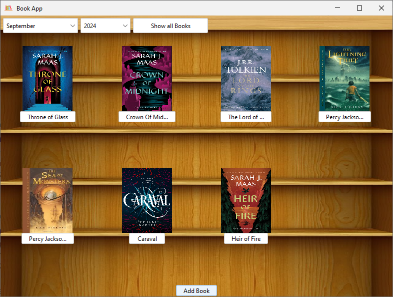
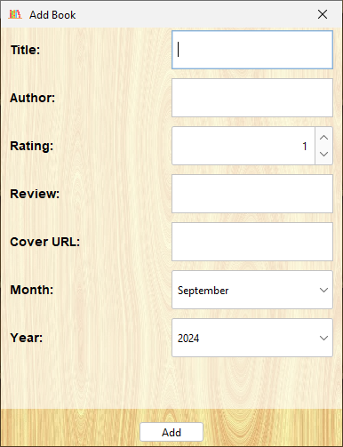
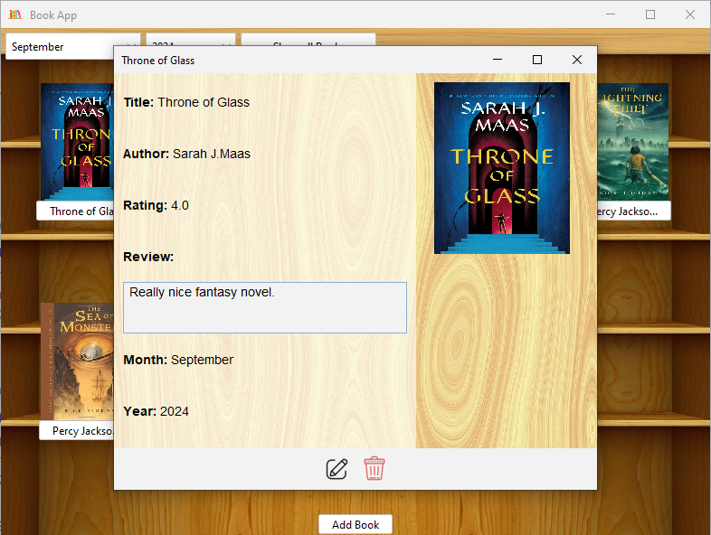

**This app was created just for Java practising.**

# BookApp
BookApp is a desktop app which with you can keep track of your readings.

By default, it shows the readings of the current month and year, but with the scrollbar you can select month and year of
your preference or also show all books inserted in the app.

To keep track of the readings in a database, SQLite is used.

### Add a book
With the button at the end of the window, a dialog page is opened. Book name and author are mandatory.
You can also add your rating (default 1.0), Cover URL, month and year in which your read the book.
In the case Cover URL is empty, an API (https://github.com/w3slley/bookcover-api.git) is used for retrive a cover for the book.  

 

### Show details
If you click on the title of the book, a dialog window which shows all the details is showed.
You can also edit the informations by clicking the icon to the right at the bottom of the window, or also delete that 
book from your library.

 

